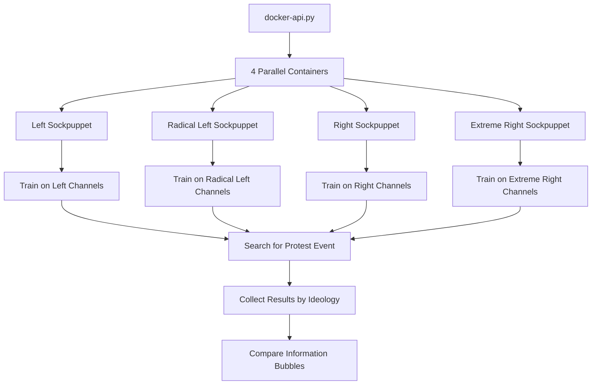

# YouTube Sockpuppets for Political Ideology Analysis

## 📋 Description

This project creates and trains automated "sockpuppets" (virtual accounts) on YouTube to study political information bubbles. Each sockpuppet trains on content from specific political ideologies, then searches for protest events to analyze how YouTube's recommendation algorithm creates different "realities" for different political orientations.

## 🎯 Objective

- **Study protest events** through ideology-specific YouTube recommendations
- **Analyze information bubbles** created by recommendation algorithms
- **Measure polarization** in content recommendations across political spectrum
- **Collect comparative data** on how different ideologies "see" the same events

## 🔍 Core Research Application

The system trains sockpuppets representing 4 political ideologies:
- **Left** (`gauche`) - Traditional left-wing perspective
- **Radical Left** (`gauche radicale`) - Far-left and anti-establishment  
- **Right** (`droite`) - Traditional right-wing and conservative
- **Extreme Right** (`droite extrême`) - Far-right and nationalist

Each sockpuppet:
1. **Trains** by watching videos from channels aligned with its ideology
2. **Searches** for configurable protest events (e.g., "gilet jaune", "Black Lives Matter", "farmer protests")  
3. **Collects** search results and recommendations
4. **Generates** ideology-specific data for comparative analysis

## 🏗️ Architecture

### Main Components

| Component | Purpose | Technology |
|-----------|---------|------------|
| **`docker-api.py`** | Main orchestration system with configurable parameters | Python + Docker API |
| **`sockpuppet.py`** | Individual sockpuppet logic and execution | Python |
| **`eytdriver_autonomous.py`** | Modern YouTube automation driver (2025 selectors) | Selenium WebDriver |
| **`Dockerfile`** | Container environment with headless Chrome | Ubuntu + Chrome |
| **`data/chaines_clean.csv`** | 48 political channels classified by ideology | CSV Database |
| **`examples.py`** | Usage examples for different protest events | Python Helper |

### System Flow



## 📦 Installation & Setup

### Prerequisites

- **Docker Desktop** (Windows/Mac/Linux)
- **8GB RAM minimum** (for parallel Chrome instances)
- **Python 3.8+** with pip
- **Stable internet connection**

### 1. Clone and Setup

```bash
# Clone the repository
git clone [repository-url]
cd code_ytb_bcn

# Install Python dependencies (optional, for examples)
pip install pandas docker

# Verify Docker installation
docker --version
```

### 2. Build Docker Image

```bash
# Build the sockpuppet image (takes 5-10 minutes)
docker build -t fr-spain_ytb .
```

The build downloads and installs:
- Ubuntu base system
- Google Chrome (latest)
- ChromeDriver (compatible version)
- Python environment with all dependencies

### 3. Verify Data Structure

```
code_ytb_bcn/
├── docker-api.py           # Main orchestration system
├── sockpuppet.py          # Individual sockpuppet logic
├── eytdriver_autonomous.py # YouTube automation driver
├── examples.py            # Usage examples
├── Dockerfile             # Container definition
├── requirements.txt       # Python dependencies
├── data/
│   └── chaines_clean.csv  # 48 channels by ideology
├── arguments/             # Generated configs (auto-created)
└── output/               # Results storage (auto-created)
    ├── puppets/          # Sockpuppet execution data
    ├── profiles/         # Persistent Chrome profiles
    └── exceptions/       # Error logs
```

## 🚀 Usage

### Quick Start: Analyze Gilet Jaune Protests

```bash
# Default configuration: 5 channels per ideology, "gilet jaune" search
python docker-api.py --run --mode channels --training-channels data/chaines_clean.csv

# Monitor execution
docker ps
```

This launches 4 parallel containers that:
1. Train on 5 random channels per ideology (5 videos each = 25 videos per sockpuppet)
2. Search for "gilet jaune" 
3. Collect 10 search results + 10 recommendations per ideology
4. Save results in `output/puppets/`

### Advanced Usage: Configurable Parameters

```bash
# Black Lives Matter analysis with custom parameters
python docker-api.py --run \
  --mode channels \
  --training-channels data/chaines_clean.csv \
  --search-query "Black Lives Matter" \
  --num-channels-per-ideology 6 \
  --num-videos-per-channel 3 \
  --max-search-results 15 \
  --max-recommendations 12

# Farmer protests with intensive training
python docker-api.py --run \
  --mode channels \
  --training-channels data/chaines_clean.csv \
  --search-query "manifestation agriculteurs" \
  --num-channels-per-ideology 8 \
  --num-videos-per-channel 2 \
  --max-search-results 20 \
  --max-recommendations 15
```

### Parameter Reference

| Parameter | Default | Description | Example Values |
|-----------|---------|-------------|----------------|
| `--search-query` | `"gilet jaune"` | Protest event to search for | `"Black Lives Matter"`, `"farmer protests"`, `"climat manifestation"` |
| `--num-channels-per-ideology` | `5` | Random channels selected per ideology | `3-10` (depending on available channels) |
| `--num-videos-per-channel` | `5` | Popular videos watched per channel | `2-6` (training intensity) |
| `--max-search-results` | `10` | Search results collected | `5-20` (data quantity) |
| `--max-recommendations` | `10` | Recommendations after first video | `5-20` (recommendation depth) |
| `--mode` | `channels` | Training mode | `channels` (recommended) or `videos` |
| `--training-channels` | `data/chaines_clean.csv` | Channel database file | Path to CSV with ideology classifications |

### Simulation Mode (Test Without Execution)

```bash
# Test configuration without launching containers
python docker-api.py --simulate \
  --mode channels \
  --training-channels data/chaines_clean.csv \
  --search-query "manifestation étudiante" \
  --num-channels-per-ideology 3 \
  --num-videos-per-channel 2
```

Simulation mode:
- ✅ Validates all parameters
- ✅ Shows channel selection per ideology  
- ✅ Generates JSON configurations
- ❌ Does not launch Docker containers
- ❌ Does not execute actual YouTube automation

### Examples Script

```bash
# See predefined examples for different protest events
python examples.py

# Execute one of the examples
python examples.py --execute
```

## 📊 Data Structure

### Input: Political Channels Database

`data/chaines_clean.csv` contains 48 French political YouTube channels:

```csv
Type;id;Abonné.e.s;Description;id_ytb;idee_pol;thématique;commentaire;channel_id
Média;ARTE;4300000;Cultural documentaries;arte;gauche;Culture, Politics;;UCwI-JbGNsojunnHbFAc0M4Q
Média;LeMonde;1200000;News and analysis;lemondefr;gauche;News, Politics;;UClKO-cGN3KND8sG6l3-dGdw
Politique;LeFigaro;890000;Conservative news;lefigaro;droite;News, Politics;;UCp-LfOhq99NzOnUw8wzKNdw
```

**Key columns:**
- `idee_pol`: Political ideology classification
- `channel_id`: YouTube channel identifier  
- `id_ytb`: YouTube handle (@arte, @lemondefr, etc.)
- `thématique`: Content topics

**Available ideologies:**
- `gauche` (18 channels) - Left-wing: ARTE, Le Monde, France Inter, etc.
- `droite` (11 channels) - Right-wing: Le Figaro, RTL, Europe 1, etc.
- `droite extrême` (11 channels) - Far-right: CNews, Sud Radio, etc.  
- `gauche radicale` (8 channels) - Far-left: Blast, Mediapart, etc.

### Output: Sockpuppet Execution Data

Each sockpuppet generates a JSON file in `output/puppets/`:

```json
{
    "puppet_id": "Left,K5le9sYdYkM,b908b734",
    "ideology": "Left",
    "search_query": "gilet jaune",
    "start_time": "2025-07-30 10:30:45",
    "end_time": "2025-07-30 10:45:20", 
    "duration_minutes": 14.58,
    "training_completed": true,
    "search_completed": true,
    "actions": [
        {
            "action": "channel_training_start",
            "timestamp": "2025-07-30 10:30:45",
            "params": {
                "ideology": "Left",
                "channels_count": 5,
                "videos_per_channel": 5
            }
        },
        {
            "action": "watch_video",
            "timestamp": "2025-07-30 10:31:20",
            "params": {
                "video_id": "abc123",
                "channel": "ARTE",
                "duration": 30
            }
        },
        {
            "action": "search_start",
            "timestamp": "2025-07-30 10:40:15",
            "params": {
                "query": "gilet jaune"
            }
        },
        {
            "action": "search_results_collected",
            "timestamp": "2025-07-30 10:41:00",
            "params": {
                "video_ids": ["9i3alzuVFXo", "5kTpDSkurxo", "3gJtUV8sKL0"],
                "count": 10
            }
        },
        {
            "action": "recommendations_collected", 
            "timestamp": "2025-07-30 10:43:30",
            "params": {
                "video_ids": ["_UGzz4m-Yqg", "ld-f9b3OSTg", "shi6I6mkJAk"],
                "count": 10,
                "source_video": "9i3alzuVFXo"
            }
        }
    ],
    "configuration": {
        "search_query": "gilet jaune",
        "num_channels_per_ideology": 5,
        "num_videos_per_channel": 5,
        "max_search_results": 10,
        "max_recommendations": 10
    }
}
```

## 🔧 Monitoring & Troubleshooting

### Monitor Execution

```bash
# Check running containers
docker ps

# View container logs (replace with actual container name)
docker logs sockpuppet_left_a1b2c3d4

# Check resource usage
docker stats

# View generated configurations
ls arguments/
cat arguments/Left,K5le9sYdYkM,b908b734.json
```

### Common Issues & Solutions

#### Problem: Containers crash on startup
**Cause**: Chrome profile conflicts in parallel execution
**Solution**: Automatic unique profile generation implemented
```python
# Each container gets unique profile directory
unique_suffix = f"{int(time.time())}{random.randint(1000, 9999)}"
profile_dir = f"/app/output/profiles/{puppet_id}_{unique_suffix}"
```

#### Problem: Search queries fail with special characters  
**Cause**: URL encoding issues with spaces and accents
**Solution**: Proper URL encoding implemented
```python
from urllib.parse import quote_plus
encoded_query = quote_plus("gilet jaune")  # Handles spaces correctly
```

#### Problem: "No channels found for ideology"
**Cause**: CSV file format or ideology name mismatch
**Solution**: Verify CSV structure and ideology names
```bash
# Check available channels per ideology
python -c "
import pandas as pd
df = pd.read_csv('data/chaines_clean.csv', sep=';')
print(df['idee_pol'].value_counts())
"
```

#### Problem: Containers use too much memory
**Cause**: Multiple Chrome instances in parallel
**Solution**: Limit concurrent containers
```bash
python docker-api.py --run --max-containers 2  # Reduce from default 10
```

### Log Files

- **Execution logs**: `docker logs [container_name]`
- **Error exceptions**: `output/exceptions/[puppet_id]`
- **Chrome profiles**: `output/profiles/[puppet_id]/`
- **Results data**: `output/puppets/[puppet_id]`

## 📈 Analysis & Results

### Expected Output

For each protest event analysis, you get:

1. **4 ideology-specific datasets** (Left, Radical Left, Right, Extreme Right)
2. **Search results comparison** showing algorithmic filtering by ideology
3. **Recommendation bubbles** demonstrating how each ideology "sees" the event
4. **Temporal data** tracking the complete training and search process

### Sample Research Questions

- **Information Bubbles**: How do search results for "gilet jaune" differ between left and right sockpuppets?
- **Algorithmic Bias**: Which videos appear in recommendations for far-right vs far-left ideologies?
- **Polarization Measurement**: What percentage of content is shared vs unique across political spectrum?
- **Event Framing**: How do different ideologies receive different narratives about the same protest?

### Analysis Scripts

Create custom analysis scripts using the JSON output:

```python
import json
import pandas as pd
from pathlib import Path

# Load all sockpuppet results
results = {}
for file in Path("output/puppets").glob("*.json"):
    with open(file) as f:
        data = json.load(f)
        ideology = data["puppet_id"].split(",")[0]
        results[ideology] = data

# Compare search results across ideologies
for ideology, data in results.items():
    search_results = [action["params"] for action in data["actions"] 
                     if action["action"] == "search_results_collected"][0]
    print(f"{ideology}: {len(search_results['video_ids'])} search results")

# Analyze recommendation overlap
def analyze_overlap(results):
    recommendations = {}
    for ideology, data in results.items():
        rec_actions = [action for action in data["actions"] 
                      if action["action"] == "recommendations_collected"]
        if rec_actions:
            recommendations[ideology] = set(rec_actions[0]["params"]["video_ids"])
    
    # Calculate pairwise overlaps
    for i1, (id1, recs1) in enumerate(recommendations.items()):
        for i2, (id2, recs2) in enumerate(list(recommendations.items())[i1+1:], i1+1):
            overlap = len(recs1 & recs2)
            total = len(recs1 | recs2)
            print(f"{id1} vs {id2}: {overlap}/{total} overlap ({overlap/total*100:.1f}%)")

analyze_overlap(results)
```

## 🤝 Contributing

### Extending for New Research

1. **Add new protest events**: Modify `--search-query` parameter
2. **Include new channels**: Update `data/chaines_clean.csv` with additional political channels
3. **Modify training intensity**: Adjust `--num-channels-per-ideology` and `--num-videos-per-channel`
4. **Change collection depth**: Modify `--max-search-results` and `--max-recommendations`

### Technical Improvements

- **New selectors**: Update `eytdriver_autonomous.py` if YouTube changes interface
- **Additional ideologies**: Extend the 4-ideology system in `docker-api.py`
- **Better analysis**: Create additional analysis scripts for specific research questions
- **Performance**: Optimize Chrome resource usage for larger parallel execution

## 📄 License

This project is for academic research purposes. Please cite appropriately if used in academic work.

## 🏷️ Technical Details

### Built With
- **Python 3.8+** with Selenium, Pandas, Docker API
- **Google Chrome** (headless) with ChromeDriver
- **Docker** for containerization and parallel execution
- **Ubuntu 20.04** as container base system

### Performance
- **Memory**: ~500MB per container (4 containers = ~2GB total)
- **Execution time**: 15-25 minutes per complete analysis
- **Throughput**: ~100 videos watched + 40 data points collected per ideology
- **Scalability**: Configurable parallel containers (default max: 10)

### Tested On
- Windows 10/11 with Docker Desktop
- Linux (Ubuntu/Debian) with Docker CE  
- macOS with Docker Desktop

For questions, issues, or research collaboration, please open an issue in the repository.


