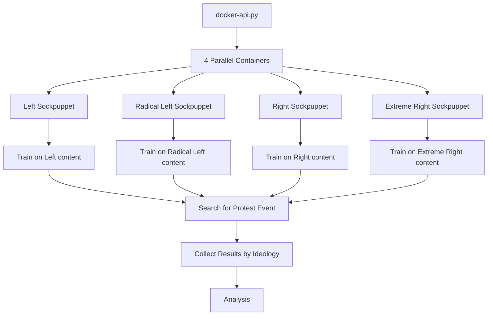

# YouTube Sockpuppets for Political Ideology Analysis

## Description

This project creates and trains automated "sockpuppets" (virtual accounts) on YouTube to study political ideology bias in the YTB algorithm. Each sockpuppet trains on content from specific political ideologies, then searches for protest events to analyze how YouTube's recommendation algorithm affects the results. This project replicates and extends the sockpuppet component of the study "YouTube, The Great Radicalizer? Auditing and Mitigating Ideological Biases in YouTube Recommendations" (Haroon et al., 2022), using the authors' publicly available driver to update and adapt it to the European context and to the study of protest-related content.

The system trains sockpuppets representing 4 political ideologies (instead of 5 in the initial project):
- **Left** (`gauche`) 
- **Radical Left** (`gauche radicale`)
- **Right** (`droite`) 
- **Extreme Right** (`droite extrême`) 


### System Flow



### File Architecture


| File | Purpose | Code | Interactions |
|------|---------|------------|--------------|
| **`docker-api.py`** | Main orchestration system and parallel execution controller | Python + Docker API | Reads `data`, generates `arguments/*.json`, launches containers with `sockpuppet.py` |
| **`sockpuppet.py`** | Individual sockpuppet execution logic and training/search workflow | Python | Uses `EYTDriver.py`, reads channel data, executes training phases, saves results to `output/` |
| **`EYTDriver.py`** | Modern YouTube automation driver with 2025 selectors | Selenium WebDriver | Used by `sockpuppet.py`, handles Chrome/Firefox, manages YouTube navigation and data collection |
| **`Dockerfile`** | Container environment with headless Chrome and Python dependencies | Ubuntu + Chrome + Python | Packages entire system for isolated parallel execution |
| **`requirements.txt`** | Python package dependencies for the entire system | pip/PyPI | Used by `Dockerfile` and local development setup |
| **`data`** | database with ideology classifications (channel or videos) | CSV Database | Read by `docker-api.py` and `sockpuppet.py` for channel selection and filtering |
| **`examples/`** | Usage examples and testing scripts | Python Scripts | check if everything works |

### Differences with UC Davis projet (to finish) 

**Updates**

- Updated selectors that were previously obsolete (2025 YouTube version)

- Implementation of consent handling specific to the European context

- Added several functions enabling navigation to channels instead of individual videos

- Sockpuppets can now be trained on channels rather than on videos

- General update of the project to ensure compatibility with the 2025 version of YouTube

##  Installation

### Prerequisites

- **Docker Desktop** (Windows/Mac/Linux)
- **8GB RAM minimum** (for parallel Chrome instances)
- **Python 3.8+** with pip
- **Stable internet connection**

### 1. Check docker version 

```bash
docker -version
```

### 2. Build Docker Image

```bash
# Build the sockpuppet image (takes 5-10 minutes)
docker build -t fr-spain_ytb .
```

The build downloads and installs:
- Ubuntu base system
- Google Chrome (latest)
- ChromeDriver (compatible version)
- Python environment with all dependencies

### 3.  Structure


```
code_ytb_bcn/
├── docker-api.py           # Main orchestration system
├── sockpuppet.py          # Individual sockpuppet logic
├── eytdriver_autonomous.py # YouTube automation driver
├── Dockerfile             # Container definition
├── requirements.txt       # Python dependencies
├── data/
│   └── chaines_clean.csv  # channels or videos classified 
├── arguments/             # Generated configs (auto-created)
└── output/               # Results storage (auto-created)
    ├── puppets/          # Sockpuppet execution data
    ├── profiles/         # Persistent Chrome profiles
    └── exceptions/       # Error logs
```

Copy the repository 

###  Example : Gilet Jaune Protests

```bash
# Default configuration: 5 channels per ideology, "gilet jaune" search
python docker-api.py --run --mode channels --training-channels data/chaines_clean.csv

# Monitor execution
docker ps
```

This launches 4 parallel containers that:
1. Train on 5 random channels per ideology (5 videos each = 25 videos per sockpuppet)
2. Search for "gilet jaune" 
3. Collect 10 search results + 10 recommendations per ideology
4. Save results in `output/puppets/`

### Configurable Parameters

# Farmer protests example

``` bash 
python docker-api.py --run \
  --mode channels \
  --training-channels data/chaines_clean.csv \
  --search-query "manifestation agriculteurs" \
  --num-channels-per-ideology 8 \
  --num-videos-per-channel 2 \
  --max-search-results 20 \
  --max-recommendations 15
```

### Parameter Reference

| Parameter | Default | Description |  |
|-----------|---------|-------------|----------------|
| `--search-query` | `"gilet jaune"` | Protest event to search for | `"gilets jaunes"` |
| `--num-channels-per-ideology` | `5` | Random channels selected per ideology | `10` |
| `--num-videos-per-channel` | `5` | Popular videos watched per channel | (training intensity) |
| `--max-search-results` | `10` | Search results collected | (data quantity) |
| `--max-recommendations` | `10` | Recommendations after first video | (recommendation depth) |
| `--mode` | `channels` | Training mode | `channels` or `videos` |
| `--training-channels` | `data/chaines_clean.csv` | Channel database file | Path to CSV with ideology classifications |

### Simulation Mode (Test Without Execution)

```bash
# Test configuration without launching containers
python docker-api.py --simulate \
  --mode channels \
  --training-channels data/chaines_clean.csv \
  --search-query "manifestation étudiante" \
  --num-channels-per-ideology 3 \
  --num-videos-per-channel 2
```


### Examples, for each part of the project (driver, sockpuppet, dockers)

```bash
# See predefined examples for different protest events
python examples.py

# Execute one of the examples
python examples.py --execute
```

##  Data Structure


### Output: Sockpuppet Execution Data

Each sockpuppet generates a JSON file in `output/puppets/`:

```json
{
    "puppet_id": "Left,K5le9sYdYkM,b908b734",
    "ideology": "Left",
    "search_query": "gilet jaune",
    "start_time": "2025-07-30 10:30:45",
    "end_time": "2025-07-30 10:45:20", 
    "duration_minutes": 14.58,
    "training_completed": true,
    "search_completed": true,
    "actions": [
        {
            "action": "channel_training_start",
            "timestamp": "2025-07-30 10:30:45",
            "params": {
                "ideology": "Left",
                "channels_count": 5,
                "videos_per_channel": 5
            }
        },
        {
            "action": "watch_video",
            "timestamp": "2025-07-30 10:31:20",
            "params": {
                "video_id": "abc123",
                "channel": "ARTE",
                "duration": 30
            }
        },
        {
            "action": "search_start",
            "timestamp": "2025-07-30 10:40:15",
            "params": {
                "query": "gilet jaune"
            }
        },
        {
            "action": "search_results_collected",
            "timestamp": "2025-07-30 10:41:00",
            "params": {
                "video_ids": ["9i3alzuVFXo", "5kTpDSkurxo", "3gJtUV8sKL0"],
                "count": 10
            }
        },
        {
            "action": "recommendations_collected", 
            "timestamp": "2025-07-30 10:43:30",
            "params": {
                "video_ids": ["_UGzz4m-Yqg", "ld-f9b3OSTg", "shi6I6mkJAk"],
                "count": 10,
                "source_video": "9i3alzuVFXo"
            }
        }
    ],
    "configuration": {
        "search_query": "gilet jaune",
        "num_channels_per_ideology": 5,
        "num_videos_per_channel": 5,
        "max_search_results": 10,
        "max_recommendations": 10
    }
}
```


## Monitor Execution

```bash
# Check running containers
docker ps

# View container logs (replace with actual container name)
docker logs sockpuppet_left_a1b2c3d4

# Check resource usage
docker stats

# View generated configurations
ls arguments/
cat arguments/Left,K5le9sYdYkM,b908b734.json
```

