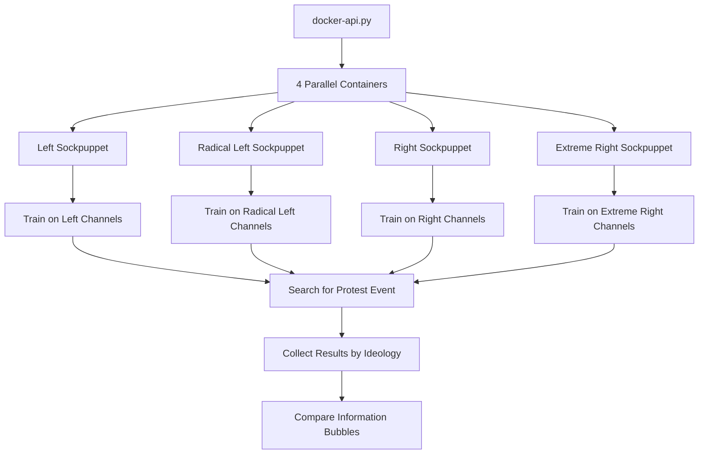

# YouTube Sockpuppets for Political Ideology Analysis

## 📋 Description

This project creates and trains automated "sockpuppets" (virtual accounts) on YouTube to study political ideology bias in the YTB algorithm. Each sockpuppet trains on content from specific political ideologies, then searches for protest events to analyze how YouTube's recommendation algorithm affect the results. 

The system trains sockpuppets representing 4 political ideologies:
- **Left** (`gauche`) - Traditional left-wing perspective
- **Radical Left** (`gauche radicale`) - Far-left and anti-establishment  
- **Right** (`droite`) - Traditional right-wing and conservative
- **Extreme Right** (`droite extrême`) - Far-right and nationalist


## 🏗️ Architecture

### Main Components

| Component | Purpose | Technology |
|-----------|---------|------------|
| **`docker-api.py`** | Main orchestration system with configurable parameters | Python + Docker API |
| **`sockpuppet.py`** | Individual sockpuppet logic and execution | Python |
| **`eytdriver_autonomous.py`** | Modern YouTube automation driver (2025 selectors) | Selenium WebDriver |
| **`Dockerfile`** | Container environment with headless Chrome | Ubuntu + Chrome |
| **`data/`** | data to train sockpuppets | CSV Database |

*** note : the ytb dossier is dedicated to the previous code from UC Davis project. 

### System Flow



### File Architecture

This project extends and modernizes the UC Davis YouTube recommendation research framework. Each component serves a specific purpose in the analysis pipeline:

| File | Purpose | Technology | Interactions |
|------|---------|------------|--------------|
| **`docker-api.py`** | Main orchestration system and parallel execution controller | Python + Docker API | Reads `data/chaines_clean.csv`, generates `arguments/*.json`, launches containers with `sockpuppet.py` |
| **`sockpuppet.py`** | Individual sockpuppet execution logic and training/search workflow | Python | Uses `EYTDriver.py`, reads channel data, executes training phases, saves results to `output/` |
| **`EYTDriver.py`** | Modern YouTube automation driver with 2025 selectors | Selenium WebDriver | Used by `sockpuppet.py`, handles Chrome/Firefox, manages YouTube navigation and data collection |
| **`Dockerfile`** | Container environment with headless Chrome and Python dependencies | Ubuntu + Chrome + Python | Packages entire system for isolated parallel execution |
| **`requirements.txt`** | Python package dependencies for the entire system | pip/PyPI | Used by `Dockerfile` and local development setup |
| **`data/chaines_clean.csv`** | Political channel database with ideology classifications | CSV Database | Read by `docker-api.py` and `sockpuppet.py` for channel selection and filtering |
| **`examples/`** | Usage examples and testing scripts | Python Scripts | Independent examples showing different system configurations |

### Project Origins

This system is based on and extends the YouTube recommendation research framework from UC Davis, with significant modifications:

**Original UC Davis Framework:**
- Basic YouTube automation for recommendation collection
- Single-threaded execution
- Limited to video-based training

**Our Extensions and Modernizations:**
- **Parallel Docker execution** - 4 simultaneous ideological sockpuppets
- **Modern 2025 YouTube selectors** - Updated for current YouTube interface
- **Channel-based training** - Train on entire political channels, not just individual videos
- **Configurable protest event analysis** - Flexible search queries and parameters
- **Political ideology framework** - Structured 4-ideology system (Left, Radical Left, Right, Extreme Right)
- **Enhanced Chrome handling** - Resolved profile conflicts for parallel execution
- **French political channel database** - 48 classified French political YouTube channels

##  Installation & Setup

### Prerequisites

- **Docker Desktop** (Windows/Mac/Linux)
- **8GB RAM minimum** (for parallel Chrome instances)
- **Python 3.8+** with pip
- **Stable internet connection**


### 2. Build Docker Image

```bash
# Build the sockpuppet image (takes 5-10 minutes)
docker build -t fr-spain_ytb .
```

The build downloads and installs:
- Ubuntu base system
- Google Chrome (latest)
- ChromeDriver (compatible version)
- Python environment with all dependencies

### 3.  Structure

```
code_ytb_bcn/
├── docker-api.py           # Main orchestration system
├── sockpuppet.py          # Individual sockpuppet logic
├── eytdriver_autonomous.py # YouTube automation driver
├── Dockerfile             # Container definition
├── requirements.txt       # Python dependencies
├── data/
│   └── chaines_clean.csv  # channels or videos classified 
├── arguments/             # Generated configs (auto-created)
└── output/               # Results storage (auto-created)
    ├── puppets/          # Sockpuppet execution data
    ├── profiles/         # Persistent Chrome profiles
    └── exceptions/       # Error logs
```

## 🚀 Usage

### Quick Start: Analyze Gilet Jaune Protests

```bash
# Default configuration: 5 channels per ideology, "gilet jaune" search
python docker-api.py --run --mode channels --training-channels data/chaines_clean.csv

# Monitor execution
docker ps
```

This launches 4 parallel containers that:
1. Train on 5 random channels per ideology (5 videos each = 25 videos per sockpuppet)
2. Search for "gilet jaune" 
3. Collect 10 search results + 10 recommendations per ideology
4. Save results in `output/puppets/`

### Advanced Usage: Configurable Parameters

```bash
# Black Lives Matter analysis with custom parameters
python docker-api.py --run \
  --mode channels \
  --training-channels data/chaines_clean.csv \
  --search-query "Black Lives Matter" \
  --num-channels-per-ideology 6 \
  --num-videos-per-channel 3 \
  --max-search-results 15 \
  --max-recommendations 12

# Farmer protests with intensive training
python docker-api.py --run \
  --mode channels \
  --training-channels data/chaines_clean.csv \
  --search-query "manifestation agriculteurs" \
  --num-channels-per-ideology 8 \
  --num-videos-per-channel 2 \
  --max-search-results 20 \
  --max-recommendations 15
```

### Parameter Reference

| Parameter | Default | Description | Example Values |
|-----------|---------|-------------|----------------|
| `--search-query` | `"gilet jaune"` | Protest event to search for | `"Black Lives Matter"`, `"farmer protests"`, `"climat manifestation"` |
| `--num-channels-per-ideology` | `5` | Random channels selected per ideology | `3-10` (depending on available channels) |
| `--num-videos-per-channel` | `5` | Popular videos watched per channel | `2-6` (training intensity) |
| `--max-search-results` | `10` | Search results collected | `5-20` (data quantity) |
| `--max-recommendations` | `10` | Recommendations after first video | `5-20` (recommendation depth) |
| `--mode` | `channels` | Training mode | `channels` (recommended) or `videos` |
| `--training-channels` | `data/chaines_clean.csv` | Channel database file | Path to CSV with ideology classifications |

### Simulation Mode (Test Without Execution)

```bash
# Test configuration without launching containers
python docker-api.py --simulate \
  --mode channels \
  --training-channels data/chaines_clean.csv \
  --search-query "manifestation étudiante" \
  --num-channels-per-ideology 3 \
  --num-videos-per-channel 2
```

Simulation mode:
- ✅ Validates all parameters
- ✅ Shows channel selection per ideology  
- ✅ Generates JSON configurations
- ❌ Does not launch Docker containers
- ❌ Does not execute actual YouTube automation

### Examples Script

```bash
# See predefined examples for different protest events
python examples.py

# Execute one of the examples
python examples.py --execute
```

##  Data Structure


### Output: Sockpuppet Execution Data

Each sockpuppet generates a JSON file in `output/puppets/`:

```json
{
    "puppet_id": "Left,K5le9sYdYkM,b908b734",
    "ideology": "Left",
    "search_query": "gilet jaune",
    "start_time": "2025-07-30 10:30:45",
    "end_time": "2025-07-30 10:45:20", 
    "duration_minutes": 14.58,
    "training_completed": true,
    "search_completed": true,
    "actions": [
        {
            "action": "channel_training_start",
            "timestamp": "2025-07-30 10:30:45",
            "params": {
                "ideology": "Left",
                "channels_count": 5,
                "videos_per_channel": 5
            }
        },
        {
            "action": "watch_video",
            "timestamp": "2025-07-30 10:31:20",
            "params": {
                "video_id": "abc123",
                "channel": "ARTE",
                "duration": 30
            }
        },
        {
            "action": "search_start",
            "timestamp": "2025-07-30 10:40:15",
            "params": {
                "query": "gilet jaune"
            }
        },
        {
            "action": "search_results_collected",
            "timestamp": "2025-07-30 10:41:00",
            "params": {
                "video_ids": ["9i3alzuVFXo", "5kTpDSkurxo", "3gJtUV8sKL0"],
                "count": 10
            }
        },
        {
            "action": "recommendations_collected", 
            "timestamp": "2025-07-30 10:43:30",
            "params": {
                "video_ids": ["_UGzz4m-Yqg", "ld-f9b3OSTg", "shi6I6mkJAk"],
                "count": 10,
                "source_video": "9i3alzuVFXo"
            }
        }
    ],
    "configuration": {
        "search_query": "gilet jaune",
        "num_channels_per_ideology": 5,
        "num_videos_per_channel": 5,
        "max_search_results": 10,
        "max_recommendations": 10
    }
}
```

## 🔧 Monitoring & Troubleshooting

### Monitor Execution

```bash
# Check running containers
docker ps

# View container logs (replace with actual container name)
docker logs sockpuppet_left_a1b2c3d4

# Check resource usage
docker stats

# View generated configurations
ls arguments/
cat arguments/Left,K5le9sYdYkM,b908b734.json
```


Create custom analysis scripts using the JSON output:

```python
import json
import pandas as pd
from pathlib import Path

# Load all sockpuppet results
results = {}
for file in Path("output/puppets").glob("*.json"):
    with open(file) as f:
        data = json.load(f)
        ideology = data["puppet_id"].split(",")[0]
        results[ideology] = data

# Compare search results across ideologies
for ideology, data in results.items():
    search_results = [action["params"] for action in data["actions"] 
                     if action["action"] == "search_results_collected"][0]
    print(f"{ideology}: {len(search_results['video_ids'])} search results")

# Analyze recommendation overlap
def analyze_overlap(results):
    recommendations = {}
    for ideology, data in results.items():
        rec_actions = [action for action in data["actions"] 
                      if action["action"] == "recommendations_collected"]
        if rec_actions:
            recommendations[ideology] = set(rec_actions[0]["params"]["video_ids"])
    
    # Calculate pairwise overlaps
    for i1, (id1, recs1) in enumerate(recommendations.items()):
        for i2, (id2, recs2) in enumerate(list(recommendations.items())[i1+1:], i1+1):
            overlap = len(recs1 & recs2)
            total = len(recs1 | recs2)
            print(f"{id1} vs {id2}: {overlap}/{total} overlap ({overlap/total*100:.1f}%)")

analyze_overlap(results)
```

